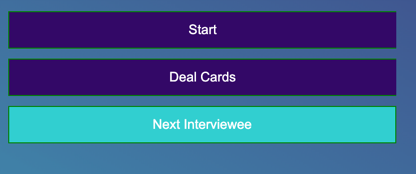

# we-will-call-you
We will call you! This is an employee recruitment role playing board game based on FunEmployed.


## Game
Deal every Applicant four Qualification cards to create their Resume.
These are private. Reveal the top Job card.
This is the Job the Applicants are applying for this round.
Give all Applicants a minute or so to figure out how they would like to apply for the job and "Build Their Resume".
After each Applicant builds their Resume, all Applicants apply to the Job, clockwise from the Employer, by explaining why their Qualifications make them the best fit for the Job.
Applicants reveal all of their Qualifications to the Employer, one at a time, and describe how each one makes them qualified for the Job. Be creative. Be funny.
After all Applicants have made their pitch, the Employer chooses which Applicant they feel is the most qualified.

## How to setup game?
1. Create a room from the home page and share the room link with your friends.

2. As a creator of the room you can start the game by clicking the Start button if everyone joined. In this step interviewer and candidate will be determined.


3. And you can deal the cards by clicking Deal Cards button after determining the interviewer and candidate. And the game is ready to play! From now on you can play the game and put your cards on to the table by clicking on them.


4. You can switch to the next candidate by clicking Next Interviewee if interview is completed, also you can start the game from the beginning by clicking Start button again if you also want to change interviewer.


## How to run?
Clone the project and setup go environment then you can run the project with the command at below.
```
git run main.go
```

## How it works?
Server side is totally written in Go, it uses Gin as HTTP framework and Gorilla for WebSocket.
And client side uses vanilla JS.

## How to play?
You can deploy the game using Dockerfile to anywhere easily but do not forget to update WebSocket Server url on [templates/scripts/room-script.js](./templates/scripts/room-script.js) file or you can run the server on your local environment and share it by using ngrok.